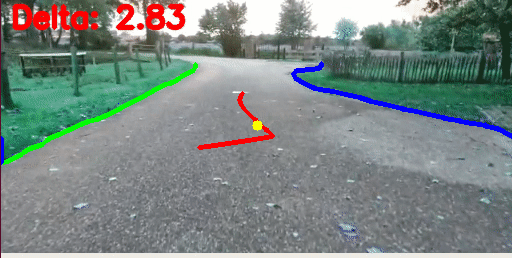

# Advanced RealTime Road Detection and Autonomous Vehicle Control using Convolutional Neural Network



# intro
The goal of this project is to make an electric ATV drive autonomosly over normal roads using an xbox kinect Camera and state of the art video processing technolgies. The electric ATV is fitted with an windshield wiper motor and costum control/feedback circuitry to control the steering and acceleration. An Arduino with Serial comminucation is used to communicate with the main computer also fitted on the ATV. The main computer has an GTX1080 to run the detection model. The Detection model and Control module are written in python. 

This project is still worked on so not everything listed below is implemented yet.

## Detection and Control is done in these steps:
- NVIDIA'S semantic-segmentation model returns every 10th frame an array with classes per pixel
- Road edges are extracted from the array with connected component filter
- Road center line is calculated from road edges with moving average filter
- Center of the frame is used as center of the vehicle to calcualte Delta between vehicle center and road center. 
- PID controller is used to generate steering commands from Delta
- Any obstacles which are on the vehucle path are detected with Kinect depth Camera.
- If obstacles are detected a speed reduce command is made
- Steering and speed commands are send over Serial to Arduino
- Arduino performs commands

## based on the great work of
https://github.com/NVIDIA/semantic-segmentation/

# Installation
- Download pretrained network from link. 
https://drive.google.com/file/d/1aGdA1WAKKkU2y-87wSOE1prwrIzs_L-h/view

- Make an folder called "pretrained_models" and copy/paste network into that folder.
- install dependencies
* An NVIDIA GPU and CUDA 9.0 or higher. Some operations only have gpu implementation.
* PyTorch (>= 0.5.1)
* Python 3
* numpy
* OpenCV 
* sklearn
* h5py
* scikit-image
* pillow
* piexif
* cffi
* tqdm
* dominate
* tensorboardX
* opencv-python
* nose
* ninja
* pandas

# Run
```
CUDA_VISIBLE_DEVICES=0 python3 start.py --video KleinMoorst.mp4 --snapshot ./pretrained_models/cityscapes_cv0_seresnext50_nosdcaug.pth --arch network.deepv3.DeepSRNX50V3PlusD_m1
```
To use a costum video change the text behind --video to any video path. 


# NVIDIA'S semantic-segmentation

@inproceedings{semantic_cvpr19,
  author       = {Yi Zhu*, Karan Sapra*, Fitsum A. Reda, Kevin J. Shih, Shawn Newsam, Andrew Tao, Bryan Catanzaro},
  title        = {Improving Semantic Segmentation via Video Propagation and Label Relaxation},
  booktitle    = {IEEE Conference on Computer Vision and Pattern Recognition (CVPR)},
  month        = {June},
  year         = {2019},
  url          = {https://nv-adlr.github.io/publication/2018-Segmentation}
}
* indicates equal contribution

@inproceedings{reda2018sdc,
  title={SDC-Net: Video prediction using spatially-displaced convolution},
  author={Reda, Fitsum A and Liu, Guilin and Shih, Kevin J and Kirby, Robert and Barker, Jon and Tarjan, David and Tao, Andrew and Catanzaro, Bryan},
  booktitle={Proceedings of the European Conference on Computer Vision (ECCV)},
  pages={718--733},
  year={2018}
}

Copyright (C) 2019 NVIDIA Corporation. Yi Zhu, Karan Sapra, Fitsum A. Reda, Kevin J. Shih, Shawn Newsam, Andrew Tao and Bryan Catanzaro.
All rights reserved. 
Licensed under the CC BY-NC-SA 4.0 license (https://creativecommons.org/licenses/by-nc-sa/4.0/legalcode).
